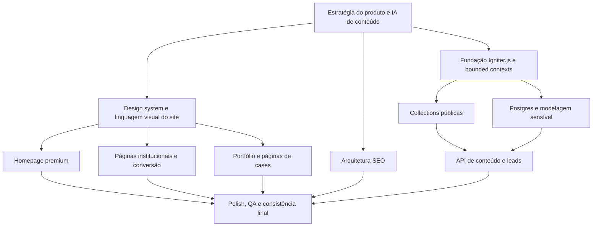

# [PLN-2026-03-25-DEMA-SITE-PLATFORM] (feature): Finalização completa do site premium da Dema + plataforma API e dados
> **Created by:** Lia  
> **Status:** in_progress  
> **Scope:** Site institucional completo, portfólio SEO, arquitetura de conteúdo, API Igniter.js, modelagem de dados e base operacional sem painel administrativo  
> **Created at:** 2026-03-25 17:10 BRT  
> **Started at:** 2026-03-25 17:55 BRT  
> **Finished at:**  

## 1. Context

O pedido deixou de ser apenas um redesign da homepage. O objetivo real é finalizar **todo o site da Dema** com padrão alto, forte presença visual, arquitetura editorial e estrutura técnica preparada para operar como ativo comercial da empresa.

A Dema precisa de duas frentes que se complementam:

- **frente institucional premium**: site completo, visual, executivo, rápido e memorável;
- **frente estrutural de dados e operação**: API bem organizada para alimentar conteúdo, cadastrar novos cases, registrar leads e servir um agente de IA no futuro, sem necessidade de painel administrativo agora.

O repositório já tem:

- base Next.js App Router e Tailwind v4;
- fundação inicial de Igniter em [`src/igniter.ts`](/Users/felipebarcelospro/Sandbox/nubler/dema-instalacoes/src/igniter.ts), [`src/igniter.context.ts`](/Users/felipebarcelospro/Sandbox/nubler/dema-instalacoes/src/igniter.context.ts) e [`src/igniter.router.ts`](/Users/felipebarcelospro/Sandbox/nubler/dema-instalacoes/src/igniter.router.ts);
- Prisma em [`src/services/database.ts`](/Users/felipebarcelospro/Sandbox/nubler/dema-instalacoes/src/services/database.ts);
- uma home inicial ainda simples e parcial;
- material estratégico relevante no portfólio de cases em [portfolio_obras_dema.md](/Users/felipebarcelospro/Sandbox/nubler/dema-instalacoes/.artifacts/references/portfolio_obras_dema.md).

Esse documento de portfólio muda bastante o projeto: agora já existe base para estruturar uma página de cases realmente premium e, mais importante, um conjunto de **single project pages** com forte potencial de SEO e autoridade comercial.

### 1.1 Research-Based Client Profile Signal

A pesquisa complementar sobre empreendimentos citados no portfólio reforça um padrão importante de mercado:

- presença forte em bairros valorizados de São Paulo, como Moema, Vila Mariana, Campo Belo, Jardins, Perdizes, Ipiranga e Santa Cecília;
- recorrência de empreendimentos residenciais urbanos e compactos de padrão médio-alto a alto, muitas vezes com forte apelo de localização e investimento;
- associação com incorporadoras/parceiros como STOG, Planik, Bracon, CGS, Shpaisman e One Innovation;
- evidência de atuação também em equipamento público de saúde, como UBS Jabaquara, o que amplia a percepção de capacidade técnica e compliance.

Isso indica que a Dema precisa ser posicionada visualmente menos como “empresa de instalações” genérica e mais como **parceira técnica confiável para empreendimentos urbanos exigentes, incorporadoras e cases com alto nível de coordenação**.

## 2. Objective

Entregar um plano integrado para construir:

1. um **site institucional completo de alto padrão** para a Dema;
2. uma **arquitetura de conteúdo escalável** para cases, serviços e páginas institucionais;
3. uma **API Igniter.js bem modelada** para operações futuras com IA;
4. uma **modelagem de dados híbrida** separando conteúdo público de dados sensíveis.

Sucesso, neste plano, significa:

- o site inteiro comunica padrão executivo, rigor técnico e confiança de obra grande;
- a homepage é forte, mas não isolada: o restante do site sustenta a mesma qualidade;
- o portfólio de cases vira um motor de autoridade e SEO;
- conteúdos editáveis de marketing ficam estruturados para crescer sem retrabalho;
- leads e contatos ficam em Postgres, sob modelagem segura e preparada para automações futuras;
- a API segue o fluxo recomendado pelo ecossistema Igniter.js, sem improviso arquitetural.

### 2.1 Business Framing

O novo projeto precisa funcionar como:

- **cartão de visitas executivo** para quem conhece a Dema pela primeira vez;
- **prova de capacidade** para construtoras, incorporadoras e parceiros;
- **base operacional silenciosa** para um agente de IA cadastrar cases, consultar conteúdo e registrar leads sem depender de CMS visual.

## 3. Non-Goals

- Não criar painel administrativo nesta fase.
- Não implementar automações complexas de CRM ou nurturing agora.
- Não transformar o site em portal pesado ou produto SaaS.
- Não duplicar toda a gestão de conteúdo entre files e banco; a arquitetura deve ter responsabilidades claras.

## 4. Specifications

### 4.1 Strategic Direction

O site deve apresentar a Dema como uma empresa de execução técnica madura, ágil e confiável, com linguagem visual mais próxima de um institucional premium de arquitetura/real estate do que de um site genérico de serviços.

### 4.2 Visual Thesis

**Infraestrutura de alto padrão com presença editorial:** superfícies limpas, imagens reais de obra, tipografia firme, ritmo calmo, poucos acentos e forte sensação de controle, precisão e acabamento.

### 4.3 Brand Tone

- **Preservar:** seriedade, proximidade, agilidade, qualidade, conhecimento técnico.
- **Elevar:** percepção de sofisticação, autoridade, escala e maturidade operacional.
- **Evitar:** cara de template, excesso de caixas, excesso de marketing vazio, visual de construtora genérica.

### 4.3.1 Premium Market Reading

Com base nos cases pesquisados, a marca deve conversar com um público que tende a valorizar:

- execução confiável em bairros e terrenos de alto valor;
- leitura de cronograma, compatibilização e disciplina de obra;
- reputação junto a incorporadoras e parceiros;
- capacidade de atuar tanto em residencial qualificado quanto em projetos institucionais.

Em termos de linguagem visual, isso pede proximidade com o universo de:

- real estate premium urbano;
- arquitetura contemporânea;
- engenharia executiva;
- materiais institucionais de incorporadoras bem posicionadas.

### 4.4 Frontend-Skill Translation

Este plano passa a adotar explicitamente o framework da `frontend-skill` para todo o site:

- cada página deve ter `visual thesis`, `content plan` e `interaction thesis`;
- cada seção deve ter **uma função**, **uma ideia dominante** e **um takeaway principal**;
- a primeira dobra de páginas institucionais deve se comportar como pôster, não como documento;
- layouts devem ser prioritariamente **cardless**;
- imagens reais precisam sustentar a narrativa;
- motion deve existir, mas com função estrutural, nunca ornamental.

### 4.5 Global Art Direction Blueprint

#### Visual thesis global

**A Dema deve parecer uma empresa que domina canteiros complexos com a mesma precisão com que apresenta sua marca: técnica, controlada, silenciosamente premium e orientada a resultado.**

#### Content plan global

- **Hero:** marca, promessa, CTA e imagem dominante
- **Support:** prova concreta de competência
- **Detail:** profundidade em serviços, cases, processo ou história
- **Final CTA:** contato direto, consultivo e sem atrito

#### Interaction thesis global

- entrada sequencial curta no hero para texto e mídia;
- transições de reveal e recorte em blocos editoriais;
- um efeito sticky ou scroll-linked em áreas-chave do portfólio/processo;
- hovers secos e precisos em CTAs, links e cases.

### 4.6 Visual System Rules

#### Typography

- usar no máximo duas famílias tipográficas;
- a tipografia principal deve soar mais editorial/técnica que utilitária;
- o nome `Dema` ou `Dema Instalações` deve ser sempre o texto mais forte na homepage;
- headlines devem ser curtas, de leitura imediata, e com ritmo de 2-3 linhas no desktop;
- textos auxiliares devem ser compactos e funcionais.

#### Color and Materiality

- preservar o laranja da marca como acento principal;
- construir base neutra sofisticada com brancos quentes, cinzas minerais, grafites e contrastes firmes;
- evitar fundos flat repetitivos em todas as seções;
- usar variação de superfície com textura sutil, planos escuros ou fotografia como contraste controlado;
- não adicionar múltiplas cores de acento.

#### Layout

- full-bleed quando a seção pedir presença de marca ou imagem;
- conteúdo interno com colunas contidas e respiro generoso;
- evitar mosaicos genéricos e grades de cartões como solução padrão;
- quando houver listas, elas devem parecer editoriais ou arquitetônicas, não “blocos de features SaaS”.

#### Imagery

- hero e páginas de obra precisam de imagem âncora real;
- preferir fotos com massa arquitetônica, estrutura, profundidade e áreas calmas para texto;
- evitar collage, mockup fake, dashboards ou abstratos sem função;
- toda imagem deve responder a uma pergunta narrativa:
  - esta imagem prova escala?
  - esta imagem prova acabamento?
  - esta imagem prova contexto real?

### 4.7 Hard Visual Rules

- sem hero card;
- sem grid de cards como primeira impressão;
- sem headline genérica do tipo “soluções completas para seu projeto” desacoplada de prova visual;
- sem ícones como linguagem principal para vender sofisticação;
- sem duplicar a mesma mensagem em múltiplas seções;
- sem carrossel sem propósito narrativo;
- sem tipografia fraca ou excessivamente tecnológica para uma empresa de obra real.

### 4.8 Product/Website Scope

O escopo do site completo deve contemplar, no mínimo:

- homepage
- página de serviços
- página de cases/portfólio
- páginas individuais de case/obra
- página sobre
- página de contato
- componentes compartilhados de header, footer, CTA, prova social e blocos institucionais
- base de SEO técnico e semântico

### 4.9 Proposed Sitemap

#### Camada institucional principal

- `/`
- `/servicos`
- `/cases`
- `/sobre-nos`
- `/contato`

#### Camada estratégica de SEO

- `/servicos/instalacoes-eletricas`
- `/servicos/instalacoes-hidraulicas`
- `/servicos/combate-a-incendio`
- `/servicos/manutencoes`
- `/cases/[slug]`

#### Camada opcional de autoridade futura

- `/segmentos/[slug]` para residencial, comercial, industrial
- `/parceiros`
- `/normas-e-seguranca`

### 4.10 UX and Conversion Requirements

- O site precisa comunicar autoridade em até 5 segundos.
- A homepage deve colocar marca, portfólio, confiança e CTA no início da jornada.
- O mobile é prioritário, especialmente para acesso em campo e contatos rápidos.
- O principal CTA deve ser curto e direto:
  - “Solicite um orçamento”
  - “Fale com um engenheiro”
  - “Ver cases”
- Formulários públicos devem ser mínimos.
- WhatsApp deve aparecer como canal de conversão imediata.

### 4.11 Global Shared Components Blueprint

#### Header

- visual limpo, premium e sólido;
- logo forte;
- navegação enxuta;
- CTA fixo de contato/orçamento;
- no mobile, menu deve parecer parte da direção visual, não fallback técnico.

#### Footer

- fechamento denso e confiável;
- acesso rápido a contato, localização, serviços e portfólio;
- sem excesso de colunas pequenas e frágeis;
- visual mais arquitetônico que “rodapé genérico corporativo”.

#### CTA blocks

- devem surgir como convites executivos, não banners promocionais;
- copy curta e pragmática;
- sempre com um passo claro.

#### Trust modules

- parceiros/clientes;
- normas e responsabilidade técnica;
- processo;
- resultados ou métricas confirmadas.
- bairros, tipologias e perfis de obra atendidos, quando isso reforçar percepção de mercado.

### 4.12 Homepage Role

A homepage continua sendo a peça central, mas agora com papel de abertura do ecossistema inteiro:

- hero brand-first;
- prova rápida de autoridade;
- blocos de serviços;
- recorte curado de cases;
- processo e compliance;
- parceiros/clientes;
- CTA final sem fricção.

### 4.13 Page Blueprints

#### 4.13.1 `/` Homepage

**Visual thesis**
- pôster institucional com presença cinematográfica e precisão técnica

**Content plan**
- Hero
- Support
- Detail
- Final CTA

**Interaction thesis**
- reveal de texto no hero
- leve parallax ou deslocamento de mídia
- transições de hover em cases e CTAs

**Section sequence**

1. **Hero full-bleed**
   - **Job:** apresentar a Dema como protagonista
   - **Dominant idea:** marca + obra real + promessa curta
   - **Takeaway:** empresa pronta para executar infraestrutura complexa com confiança
   - **Conteúdo:** logo/marca, headline, subheadline, CTA primário, CTA secundário

2. **Barra/bloco de autoridade**
   - **Job:** provar competência rápido
   - **Dominant idea:** parceiros, anos de mercado, métricas verificadas
   - **Takeaway:** a Dema já opera em contexto real e exigente
   - **Possíveis sinais:** Moema, Vila Mariana, Campo Belo, Perdizes, Ipiranga, Santa Cecília; construtoras/parceiros confirmados

3. **Serviços em estrutura editorial**
   - **Job:** orientar escopo de atuação
   - **Dominant idea:** disciplinas principais com linguagem curta
   - **Takeaway:** elétrica, hidráulica, incêndio e manutenção com profundidade

4. **Cases em destaque**
   - **Job:** gerar desejo e prova
   - **Dominant idea:** 3 a 5 cases com recortes amplos e hierarquia forte
   - **Takeaway:** a Dema executa projetos relevantes e diversos

5. **Processo + compliance**
   - **Job:** reduzir risco percebido
   - **Dominant idea:** método, prazo, ART, NRs, entrega
   - **Takeaway:** contratar a Dema significa previsibilidade e responsabilidade

6. **Parceiros / clientes**
   - **Job:** validar reputação
   - **Dominant idea:** logos e nomes bem apresentados
   - **Takeaway:** mercado já confia na Dema
   - **Possível enquadramento:** incorporadoras, parceiros de engenharia e clientes institucionais

7. **CTA final**
   - **Job:** converter
   - **Dominant idea:** contato consultivo direto
   - **Takeaway:** o próximo passo é simples

**Copy guidance**
- headline curta e firme;
- sem excesso de adjetivos;
- trocar abstração por prova concreta.

**Mobile behavior**
- hero continua full-bleed;
- header não pode empurrar demais o hero para baixo;
- bloco de autoridade deve quebrar em pilha clara;
- cases devem aparecer com recortes grandes, não miniaturas.

#### 4.13.2 `/servicos`

**Visual thesis**
- catálogo executivo e seletivo, com sensação de competência especializada

**Content plan**
- Hero
- Support
- Detail
- Final CTA

**Interaction thesis**
- reveals discretos em ancoragens e navegação local
- transições secas entre blocos de serviço

**Section sequence**

1. Hero institucional de serviços
2. Visão geral das disciplinas
3. Blocos dedicados para cada serviço principal
4. Cases relacionados por serviço
5. Bloco de normas, qualidade e responsabilidade técnica
6. CTA para orçamento

**Rules**
- evitar listar tudo como grade homogênea;
- cada serviço precisa parecer uma capacidade robusta, não item de menu;
- usar relação com cases reais para aprofundar.

#### 4.13.3 `/servicos/[slug]`

**Visual thesis**
- página de capability statement, quase como uma proposta comercial editorial

**Section sequence**

1. Hero específico do serviço
2. O que a Dema executa nessa frente
3. Onde esse serviço gera valor e reduz risco
4. Cases relacionados
5. Processo / normas aplicáveis
6. CTA

**Takeaway**
- a página deve rankear e também vender confiança operacional.

#### 4.13.4 `/cases`

**Visual thesis**
- índice editorial de portfólio com presença quase museológica

**Section sequence**

1. Hero de portfólio
2. Introdução curta sobre repertório
3. Filtros por segmento/status/serviço
4. Grade editorial de cases
5. Bloco de prova de execução
6. CTA

**Rules**
- evitar grade uniforme de thumbnails sem hierarquia;
- misturar cases hero, cases secundários e recortes densos;
- filtros devem ser úteis e limpos.
- priorizar taxonomias que revelem o perfil de mercado:
  - bairro
  - status
  - tipologia
  - parceiro/construtora

#### 4.13.5 `/cases/[slug]`

**Visual thesis**
- study page premium, com equilíbrio entre arquitetura, engenharia e resultado

**Content plan**
- Hero
- Support
- Detail
- Final CTA

**Section sequence**

1. Hero com capa dominante da obra
2. Ficha executiva do projeto
3. Descrição técnica
4. Desafio
5. Solução Dema
6. Resultados
7. Galeria ou recortes complementares
8. Cases relacionados
9. CTA

**Rules**
- a página não pode parecer post de blog;
- precisa soar como case de alto valor;
- uso de blocos informativos mais arquitetônicos que “cards”.
- sempre que possível, evidenciar também o tipo de ativo:
  - residencial compacto premium
  - edifício urbano
  - institucional/saúde
  - mixed-use ou investimento

#### 4.13.6 `/sobre-nos`

**Visual thesis**
- retrato institucional maduro, humano e técnico

**Section sequence**

1. Hero institucional
2. História da Dema
3. Filosofia de execução
4. Equipe/capacidade operacional
5. Segurança, normas e responsabilidade
6. Parceiros ou marcos
7. CTA

**Rules**
- evitar página só de texto corrido;
- trazer densidade institucional com ritmo visual.

#### 4.13.7 `/contato`

**Visual thesis**
- página de conversão premium e direta, sem burocracia

**Section sequence**

1. Hero enxuto
2. Canais rápidos
3. Formulário curto
4. Endereço/mapa/contexto regional
5. CTA secundário para WhatsApp

**Rules**
- menos campos, mais clareza;
- forte legibilidade e confiança;
- no mobile, prioridade total para contato imediato.

### 4.14 Motion Blueprint

- **Hero entrance:** fade + translate curto no conteúdo, mídia já presente
- **Scroll depth:** uma seção sticky ou progressiva na home ou nas páginas de obra
- **Hover language:** escala mínima, mudança de crop, opacidade ou underline animado
- **Menu mobile:** abertura sólida e elegante, sem efeito genérico de drawer cru
- **Performance rule:** motion deve sobreviver bem a dispositivos medianos; se pesar, remover

### 4.15 Copy System Blueprint

- headlines devem vender clareza, não poesia vaga;
- subtítulos devem explicar escopo ou valor em uma frase;
- microcopy de CTA deve soar direta e executiva;
- preferir:
  - “Infraestrutura elétrica, hidráulica e combate a incêndio para cases de alta exigência.”
  - “Solicite um orçamento.”
  - “Fale com um engenheiro.”
- evitar:
  - “soluções inovadoras para transformar sonhos em realidade”
  - “excelência e qualidade em cada detalhe” sem prova ao lado

### 4.16 Mobile-First Premium Rules

- o primeiro viewport mobile precisa manter marca, headline e CTA claros;
- evitar blocos muito baixos em contraste;
- preferir pilhas verticais com ritmo forte a grids esmagados;
- imagens devem continuar grandes e narrativas;
- CTAs precisam ser acessíveis com polegar;
- navegação e contato devem estar resolvidos em poucos toques.

### 4.17 Premium Failure Checklist

- se a hero funcionar sem imagem, a imagem está fraca;
- se a homepage puder ser confundida com uma construtora qualquer, a direção falhou;
- se a página depender de vários cards pequenos para explicar valor, a composição falhou;
- se os headings sozinhos não contarem a história, a arquitetura falhou;
- se o mobile parecer versão “adaptada” e não projetada, a execução falhou.

### 4.18 Portfolio and Cases Strategy

Com base em [portfolio_obras_dema.md](/Users/felipebarcelospro/Sandbox/nubler/dema-instalacoes/.artifacts/references/portfolio_obras_dema.md), a área de cases deve sair de “galeria” para “biblioteca de cases”.

Cada obra relevante deve ter:

- slug próprio
- status
- cliente/construtora
- localização
- capa
- galeria
- descrição técnica
- desafio
- solução Dema
- resultados
- disciplinas envolvidas
- tags/segmentos
- metadados SEO

Isso atende três objetivos ao mesmo tempo:

- melhorar percepção de porte;
- criar profundidade editorial;
- capturar buscas qualificadas de cauda longa.

### 4.19 Content Architecture

A estratégia recomendada é híbrida:

#### Conteúdo público, editorial e versionável
Usar `@igniter-js/collections` para conteúdos que fazem sentido como coleção estruturada e evolutiva:

- cases
- serviços
- páginas institucionais
- FAQs
- parceiros/clientes destacados
- blocos de prova social
- SEO metadata complementar
- taxonomias de bairro, tipologia de empreendimento e parceiro

Vantagens:

- tipagem forte
- versionamento natural no repositório
- boa aderência a conteúdo institucional
- facilidade futura para agentes de IA criarem/atualizarem conteúdo

#### Dados sensíveis e operacionais
Usar Postgres + Prisma para:

- leads
- mensagens de contato
- origem de captação
- histórico de atendimento
- notas internas
- eventuais usuários internos/agentes/sessões
- logs operacionais sensíveis

Vantagens:

- persistência transacional
- consultas seguras
- governança melhor para dados privados
- base mais adequada para CRM leve futuro

### 4.20 API Architecture with Igniter.js

A API não será pensada como backend “para painel”, e sim como backend operacional para agentes e integrações controladas.

#### Princípios

- seguir o fluxo Igniter:
  - transport layer
  - procedures
  - services
  - collections ou banco
- schemas Zod como fonte de verdade
- controllers leves
- regras de negócio em services
- procedures como ponte tipada para o contexto

#### Bounded Contexts propostos

- `site-content`
  - leitura e mutação de conteúdo editorial público
- `portfolio`
  - gestão de cases e ativos relacionados
- `lead`
  - captura e consulta de leads e contatos
- `contact`
  - recebimento e triagem de mensagens do site
- `partner`
  - logos, parceiros e destaques institucionais
- `seo`
  - metadados, slugs, schema fields e indexabilidade

#### API usage model

- o site consome conteúdo público;
- um agente de IA poderá cadastrar novos cases e atualizar conteúdo;
- contatos do site entram por endpoint público controlado;
- leitura de dados sensíveis fica restrita aos procedimentos internos/autenticados.

### 4.21 Recommended Data Modeling

#### Collections layer

**Collection: `projects`**
- `id`
- `slug`
- `title`
- `status`
- `clientName`
- `partnerName`
- `developerName`
- `locationCity`
- `locationState`
- `locationNeighborhood`
- `assetProfile`
- `projectCategory`
- `coverImage`
- `gallery`
- `summary`
- `technicalDescription`
- `challenge`
- `solution`
- `results`
- `services`
- `segments`
- `marketPositioning`
- `featured`
- `seoTitle`
- `seoDescription`
- `publishedAt`

**Collection: `services`**
- `id`
- `slug`
- `title`
- `shortDescription`
- `body`
- `serviceType`
- `heroImage`
- `featuredProjects`
- `seoTitle`
- `seoDescription`

**Collection: `pages`**
- `id`
- `slug`
- `title`
- `sections`
- `seo`

**Collection: `partners`**
- `id`
- `name`
- `slug`
- `logo`
- `website`
- `featured`

#### Postgres layer

**Table: `leads`**
- `id`
- `name`
- `company`
- `role`
- `email`
- `phone`
- `whatsapp`
- `message`
- `source`
- `interestType`
- `projectType`
- `status`
- `assignedTo`
- `createdAt`
- `updatedAt`

**Table: `contact_submissions`**
- `id`
- `leadId`
- `channel`
- `payload`
- `ip`
- `userAgent`
- `createdAt`

**Table: `lead_events`**
- `id`
- `leadId`
- `type`
- `metadata`
- `createdAt`

**Table: `agent_actions`** (opcional)
- `id`
- `actor`
- `action`
- `targetType`
- `targetId`
- `payload`
- `createdAt`

### 4.22 AI-First Operational Model

Como o gerenciamento será feito por agente de IA, a API deve ser pensada para:

- criar cases novos a partir de payload estruturado;
- atualizar campos específicos de um case;
- publicar/despublicar conteúdos;
- registrar contato vindo do site;
- listar leads por status, origem ou interesse;
- retornar conteúdo limpo e consistente para geração de páginas.

Isso pede:

- schemas muito bem definidos;
- validações rígidas;
- naming consistente;
- separação forte entre escrita pública e escrita interna.

### 4.23 SEO Requirements

- arquitetura por páginas específicas de serviço;
- cases como páginas indexáveis;
- metadata dedicada por rota;
- schema markup para `LocalBusiness`, `ProfessionalService` e, quando couber, entidades de obra/projeto;
- heading structure limpa;
- imagens com alt e naming consistentes;
- internal linking entre serviços e cases.

### 4.24 Performance and Delivery Requirements

- prioridade total para carregamento rápido no mobile;
- uso criterioso de motion;
- imagens tratadas como asset narrativo e não apenas decorativo;
- evitar dependência de JS desnecessário em páginas editoriais;
- preservar boa pontuação de Core Web Vitals.

### 4.25 Igniter.js Constraints and Notes

Com base na skill e nos pacotes instalados:

- `@igniter-js/collections` é aderente ao problema de conteúdo público;
- a implementação da API deve respeitar o fluxo `controller -> procedure -> service -> persistence`;
- os schemas devem migrar do exemplo atual de interfaces soltas para Zod como fonte de verdade;
- será necessário confirmar e alinhar a fundação real de `@igniter-js/core` usada neste projeto antes da execução da API completa;
- a camada de Collections deve ser modelada com cuidado para não virar banco sensível improvisado.

## 5. Rollback Plan

### 5.1 Triggers for Rollback

- o site ficar visualmente inconsistente entre páginas;
- a arquitetura de conteúdo duplicar responsabilidades;
- a API nascer com responsabilidades difusas entre collections e Postgres;
- a modelagem impedir evolução futura de cases e leads.
- a execução visual cair em grids genéricos, excesso de caixas ou hierarquia fraca.

### 5.2 Rollback Steps

1. Validar primeiro a arquitetura e os modelos antes de expandir execução.
2. Validar primeiro header, hero, design system e page blueprints antes de expandir o restante.
3. Implementar por camadas: visual, conteúdo, API, persistência.
4. Se uma modelagem falhar, voltar ao desenho da feature antes de popular dados reais.

## 6. Execution Strategy

### 6.1 Dependency Graph

### 6.2 Execution Phases

| Phase | Tasks | Concurrency | Agents Required | Est. Time | Notes |
|-------|-------|-------------|-----------------|-----------|-------|
| **Phase 1** | TASK-001, TASK-002 | Sequential | 1x Kai | 1-2 dias | Fechar direção estratégica e visual |
| **Phase 2** | TASK-003, TASK-004, TASK-005, TASK-006 | Parcialmente paralelizável | 1x Kai | 3-5 dias | Construção do site completo |
| **Phase 3** | TASK-007, TASK-008, TASK-009, TASK-010 | Sequencial | 1x Kai | 2-4 dias | Fundação de API e dados |
| **Phase 4** | TASK-011 | Sequential | 1x Kai, 1x Rex | 1-2 dias | Revisão, QA visual e amarração final |

### 6.3 Worktree Strategy

- Não recomendada neste momento.
- O valor principal aqui é coerência entre design, conteúdo e modelagem.

## 7. Definition of Done

- [ ] O site completo foi planejado como sistema coeso, não como conjunto de páginas soltas.
- [ ] Existe uma linguagem visual premium consistente entre homepage e páginas internas.
- [ ] Cada rota principal tem blueprint visual, sequência de seções e função clara por bloco.
- [ ] As regras da frontend-skill foram traduzidas de forma explícita para o projeto.
- [ ] Cases têm arquitetura clara, escalável e orientada a SEO.
- [ ] Serviços têm estrutura própria e potencial de rankeamento.
- [ ] O plano separa corretamente conteúdo público e dados sensíveis.
- [ ] A API está desenhada segundo padrões do Igniter.js.
- [ ] Existe modelagem inicial para cadastro de cases, parceiros, páginas e leads.
- [ ] O projeto está preparado para operação por agente de IA sem painel nesta fase.
- [ ] Existe caminho técnico claro para execução incremental sem retrabalho.

## 8. Resources

- Portfólio de cases
  - **Context**: Principal base para área de cases.
  - **Instructions**: Tratar como fonte primária para estrutura editorial do portfólio.
  - **URL/Path**: [portfolio_obras_dema.md](/Users/felipebarcelospro/Sandbox/nubler/dema-instalacoes/.artifacts/references/portfolio_obras_dema.md)

- Pesquisa complementar de perfil de empreendimentos
  - **Context**: Evidência do perfil de cliente e do nível de mercado em que a Dema opera.
  - **Instructions**: Usar para calibrar branding, taxonomias de portfólio e linguagem visual premium.
  - **URL/Path**: [Stog empreendimentos](https://stog.com.br/empreendimentos/), [MOA 292](https://stog.com.br/empreendimentos/moa-292/), [NIK Paradiso](https://planik.com.br/empreendimento/nik-paradiso/), [BR Ipiranga](https://stog.com.br/empreendimentos/br-ipiranga-bracon/), [My One Estação Campo Belo](https://www.cgsengenharia.com.br/portfolio/my-one-estacao-campo-belo/), [MOB Station](https://www.edificiomob.com.br/)

- Home e componentes atuais
  - **Context**: Base atual de frontend a ser reestruturada.
  - **Instructions**: Usar como ponto de partida, não como limite visual.
  - **URL/Path**: [`src/app/page.tsx`](/Users/felipebarcelospro/Sandbox/nubler/dema-instalacoes/src/app/page.tsx)

- Mapeamento de páginas
  - **Context**: Estrutura herdada do site antigo.
  - **Instructions**: Evoluir a estrutura preservando cobertura funcional.
  - **URL/Path**: [`docs/planning/01_PAGES_TO_RECREATE.md`](/Users/felipebarcelospro/Sandbox/nubler/dema-instalacoes/docs/planning/01_PAGES_TO_RECREATE.md)

- Skill de frontend
  - **Context**: Base de direção visual e composição.
  - **Instructions**: Aplicar full-bleed, hierarquia forte, imagery real e layouts cardless.
  - **URL/Path**: [frontend skill](/Users/felipebarcelospro/Sandbox/nubler/dema-instalacoes/.agents/skills/frontend/SKILL.md)

- Skill de Igniter.js
  - **Context**: Base obrigatória para arquitetura backend.
  - **Instructions**: Seguir procedures, services, collections e exploração de types reais.
  - **URL/Path**: [igniter-js skill](/Users/felipebarcelospro/Sandbox/nubler/dema-instalacoes/.agents/skills/igniter-js/SKILL.md)

- Collections package docs
  - **Context**: Guia de modelagem de conteúdo público.
  - **Instructions**: Usar para desenhar registries e collections versionáveis.
  - **URL/Path**: [`node_modules/@igniter-js/collections/AGENTS.md`](/Users/felipebarcelospro/Sandbox/nubler/dema-instalacoes/node_modules/@igniter-js/collections/AGENTS.md)

## 9. Tasks

### Task TASK-001: Consolidar direção estratégica do produto digital

**Flow Metadata:**
- **Priority:** Critical
- **Depends On:** None
- **Blocks:** TASK-002, TASK-006, TASK-007
- **Parallelizable:** No
- **Estimated Effort:** 4h

**Acceptance Criteria:**
- Definir posicionamento final do site.
- Definir papel de cada rota principal.
- Definir premissas de conteúdo, conversão e operação por IA.
- Consolidar leitura do perfil de cliente e tipologia de empreendimentos atendidos.

### Task TASK-002: Definir design system e direção visual premium

**Flow Metadata:**
- **Priority:** Critical
- **Depends On:** TASK-001
- **Blocks:** TASK-003, TASK-004, TASK-005
- **Parallelizable:** No
- **Estimated Effort:** 6h

**Acceptance Criteria:**
- Fechar tipografia, paleta, ritmo e princípios de composição.
- Definir padrões de hero, mídia, CTA e seções editoriais.
- Garantir coerência para o site inteiro.
- Consolidar page blueprints para todas as rotas principais.

### Task TASK-003: Redesenhar e implementar homepage premium

**Flow Metadata:**
- **Priority:** Critical
- **Depends On:** TASK-002
- **Blocks:** TASK-011
- **Parallelizable:** No
- **Estimated Effort:** 1 dia

**Acceptance Criteria:**
- Homepage comunica autoridade de forma imediata.
- Marca e portfólio aparecem com força.
- Conversão e narrativa funcionam em desktop e mobile.
- Homepage respeita integralmente hero full-bleed, composição cardless e visual anchor forte.

### Task TASK-004: Implementar páginas institucionais principais

**Flow Metadata:**
- **Priority:** High
- **Depends On:** TASK-002
- **Blocks:** TASK-011
- **Parallelizable:** Yes
- **Estimated Effort:** 1-2 dias

**Acceptance Criteria:**
- `servicos`, `sobre-nos` e `contato` seguem o mesmo nível de acabamento.
- Estrutura de conversão e consistência visual mantidas.
- Cada página cumpre seu blueprint específico sem virar repetição da homepage.

### Task TASK-005: Implementar área de cases e pages de case

**Flow Metadata:**
- **Priority:** Critical
- **Depends On:** TASK-002
- **Blocks:** TASK-011
- **Parallelizable:** Yes
- **Estimated Effort:** 1-2 dias

**Acceptance Criteria:**
- Página `/cases` funciona como índice editorial.
- Estrutura de `/cases/[slug]` definida e preparada para SEO.
- Portfólio de referência convertido em conteúdo modelável.
- As páginas de obra parecem cases premium, não posts ou galerias simples.
- Taxonomias de mercado, bairro e tipo de ativo ajudam a revelar o perfil premium do portfólio.

### Task TASK-006: Planejar e aplicar fundação SEO

**Flow Metadata:**
- **Priority:** High
- **Depends On:** TASK-001
- **Blocks:** TASK-011
- **Parallelizable:** Yes
- **Estimated Effort:** 6h

**Acceptance Criteria:**
- Titles, descriptions e linking strategy definidos.
- Arquitetura de páginas por serviço planejada.
- Schema markup e metas mapeados.

### Task TASK-007: Estruturar bounded contexts da API Igniter.js

**Flow Metadata:**
- **Priority:** Critical
- **Depends On:** TASK-001
- **Blocks:** TASK-008, TASK-009, TASK-010
- **Parallelizable:** No
- **Estimated Effort:** 6h

**Acceptance Criteria:**
- Features e contextos definidos.
- Fluxo controller/procedure/service/persistence desenhado.
- Dependências reais do Igniter validadas.

### Task TASK-008: Modelar e implementar Collections públicas

**Flow Metadata:**
- **Priority:** High
- **Depends On:** TASK-007
- **Blocks:** TASK-010
- **Parallelizable:** No
- **Estimated Effort:** 1 dia

**Acceptance Criteria:**
- Registries para `projects`, `services`, `pages` e `partners` definidos.
- Schemas Zod e patterns de conteúdo estabelecidos.
- Conteúdo público preparado para leitura e mutação controlada.

### Task TASK-009: Modelar Postgres para leads e dados sensíveis

**Flow Metadata:**
- **Priority:** Critical
- **Depends On:** TASK-007
- **Blocks:** TASK-010
- **Parallelizable:** No
- **Estimated Effort:** 6h

**Acceptance Criteria:**
- Modelo Prisma inicial cobre leads, submissions e eventos.
- Responsabilidades sensíveis não vazam para Collections.
- Base preparada para futuras automações.

### Task TASK-010: Planejar e implementar API operacional

**Flow Metadata:**
- **Priority:** Critical
- **Depends On:** TASK-008, TASK-009
- **Blocks:** TASK-011
- **Parallelizable:** No
- **Estimated Effort:** 1-2 dias

**Acceptance Criteria:**
- Endpoints/controladores para conteúdo e leads definidos.
- Procedures e services centralizam regras.
- API pronta para agente de IA operar sem painel.

### Task TASK-011: QA, polish e revisão de plataforma

**Flow Metadata:**
- **Priority:** High
- **Depends On:** TASK-003, TASK-004, TASK-005, TASK-006, TASK-010
- **Blocks:** None
- **Parallelizable:** No
- **Estimated Effort:** 1 dia

**Acceptance Criteria:**
- Site e API fecham como plataforma coerente.
- Revisão visual, estrutural e técnica concluída.
- Riscos remanescentes documentados.
- Litmus checks visuais da frontend-skill aprovados para desktop e mobile.

## 10. Documentation Updates

### 10.1 Site Documentation

- [`docs/planning/01_PAGES_TO_RECREATE.md`](/Users/felipebarcelospro/Sandbox/nubler/dema-instalacoes/docs/planning/01_PAGES_TO_RECREATE.md) [pending] — expandir para sitemap final e status por rota.
- [`docs/planning/02_COMPONENT_MAP.md`](/Users/felipebarcelospro/Sandbox/nubler/dema-instalacoes/docs/planning/02_COMPONENT_MAP.md) [pending] — alinhar com novo design system.
- [`docs/planning/03_ASSETS.md`](/Users/felipebarcelospro/Sandbox/nubler/dema-instalacoes/docs/planning/03_ASSETS.md) [pending] — mapear novas imagens de cases e capas.
- [`docs/planning/04_API_SCHEMA.md`](/Users/felipebarcelospro/Sandbox/nubler/dema-instalacoes/docs/planning/04_API_SCHEMA.md) [pending] — substituir visão genérica por modelagem real de collections + Postgres.

### 10.2 README Updates

- [`README.md`](/Users/felipebarcelospro/Sandbox/nubler/dema-instalacoes/README.md) [pending] — refletir o escopo de plataforma completa.

### 10.3 AGENTS.md Updates

- Nenhuma alteração obrigatória nesta etapa, mas a execução deve manter memórias e documentação sincronizadas.

---

## 11. Plan Observations

- 2026-03-25 17:10 BRT (Lia):
  - O projeto ganhou um eixo muito mais forte quando o portfólio de cases entrou como fonte primária. Isso transforma o site de institucional simples em plataforma de autoridade.
  - A melhor separação arquitetural é: `Collections` para conteúdo público e editorial; `Postgres` para contato, lead e operação sensível.
  - Como não haverá painel agora, a qualidade dos schemas, dos procedimentos e da modelagem de conteúdo é ainda mais importante.
- 2026-03-25 17:25 BRT (Lia):
  - O plano foi elevado para blueprint visual completo. A execução agora pode mirar um resultado premium com menos margem para cair em padrões genéricos.
- 2026-03-25 17:40 BRT (Lia):
  - A pesquisa externa reforçou que a Dema atua em um ecossistema mais qualificado de empreendimentos urbanos do que o site atual deixa transparecer. Isso deve aparecer no design, na taxonomia do portfólio e na forma como a marca se apresenta.
