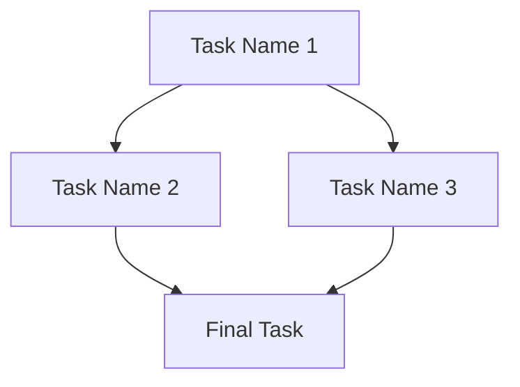

# [PLN_ID] ([type]): [Title]
> **Created by:** [Agent/Person]  
> **Status:** [Status]  
> **Scope:** [Scope]  
> **Created at:** [Datetime]  
> **Started at:** [Datetime]  
> **Finished at:** [Datetime]

## 1. Context

[Describe the background, current situation, and why this plan is needed. Include any relevant history or previous attempts.]

---

## 2. Objective

[Clear, measurable objective. What does success look like? Be specific about the end state.]

---

## 3. Non-Goals

[Explicitly list what this plan will NOT address. This prevents scope creep and sets clear boundaries.]

- [Non-goal 1]
- [Non-goal 2]

## 4. Specifications

[Technical or functional specifications. Include architecture decisions, patterns to follow, and implementation details.]

### 4.1 Technical Requirements
- [Requirement 1]
- [Requirement 2]

### 4.2 Patterns to Follow
- [Pattern 1 with reference]
- [Pattern 2 with reference]

### 4.3 Constraints
- [Constraint 1]
- [Constraint 2]

## 5. Rollback Plan

[How to revert if something goes wrong. Be specific about steps and triggers.]

### 5.1 Triggers for Rollback
- [Condition that triggers rollback]

### 5.2 Rollback Steps
1. [Step 1]
2. [Step 2]

## 6. Execution Strategy

### 6.1 Dependency Graph

> _Visualize task dependencies and identify parallelization opportunities._

### 6.2 Execution Phases

> _Define how Lia should orchestrate parallel vs sequential execution._

> **Zed Note:** Use Zed only for isolated parallel tasks and only if Section 6.3 is fully defined and user-approved.

| Phase | Tasks | Concurrency | Agents Required | Est. Time | Notes |
|-------|-------|-------------|-----------------|-----------|-------|
| **Phase 1** | TASK-001 | Sequential (1x) | 1x Kai | 30m | Critical path, blocks all |
| **Phase 2** | TASK-002, TASK-003 | Parallel (2x) | 2x Kai | 2h | Independent work |
| **Phase 3** | TASK-004 | Sequential (1x) | 1x Kai, 1x Rex | 1h | Integration + Review |

**Parallelization Efficiency:**
- **Sequential Total:** [Calculate: sum of all task times] 
- **Parallelized Total:** [Calculate: longest path through graph]
- **Time Saved:** [Calculate: difference and percentage]

### 6.3 Worktree Strategy (Only if using Zed)

> _Define the git worktree workflow for parallel execution. Required if any task is assigned to Zed._

- **Approval Gate:** Explicit user approval required before using Zed.
- **Base Branch:** [e.g., main]
- **Worktree Naming:** [e.g., zed/PLN-YYYY-MM-DD-TASK-001]
- **Workspace Root:** [e.g., ../worktrees]
- **Sync Policy:** [How/when to rebase or merge from base]
- **Conflict Resolution:** [Owner and procedure]
- **Integration Plan:** [How results are merged back]
- **Review Path:** [Rex review requirements]
- **Cleanup:** [When to remove worktrees]

## 7. Definition of Done

[Criteria that must ALL be met for the plan to be considered complete.]

- [ ] [Criterion 1]
- [ ] [Criterion 2]
- [ ] [Criterion 3]
- [ ] All tasks completed and reviewed
- [ ] Documentation updated (if applicable)
- [ ] Tests passing (if applicable)

## 8. Resources

[Universal resource format - can include files, URLs, repositories, or any knowledge source.]

- [Title 1]
  - **Context**: [Why this resource is relevant to the plan]
  - **Instructions**: [How to use this resource, what to look for]
  - **URL/Path**: [Link or path to the resource]
- [Title 2]
  - **Context**: [Why this resource is relevant to the plan]
  - **Instructions**: [How to use this resource, what to look for]
  - **URL/Path**: [Link or path to the resource]

## 9. Tasks
[Track each task required to complete the plan. Follow the Task Template on `.artifacts/templates/task.template.md`]

### Task [ID]: [Task Name]

**Flow Metadata:**
- **Priority:** [Critical | High | Normal | Low]
- **Depends On:** [TASK-XXX, TASK-YYY] or [None]
- **Blocks:** [TASK-ZZZ] or [None]
- **Parallelizable:** [Yes | No]
- **Estimated Effort:** [time estimate]

**Touchpoints:**
...rest of the task

## 10. Documentation Updates
[Tracked after all tasks are complete. Filled by documentation specialists.]

### 10.1 Site Documentation

- [page1.md][status](path/to/page1.md) — [Reason for update]

### 10.2 README Updates

- [*/README.md][status](*/README.md) — [Reason for update]

### 10.3 AGENTS.md Updates

- [*/AGENTS.md][status](*/AGENTS.md) — [Reason for update]

---

## 11. Plan Observations

[General observations about the plan execution, learnings, and retrospective notes.]

- [Datetime] ([Agent Name]): 
  - [Observation]
